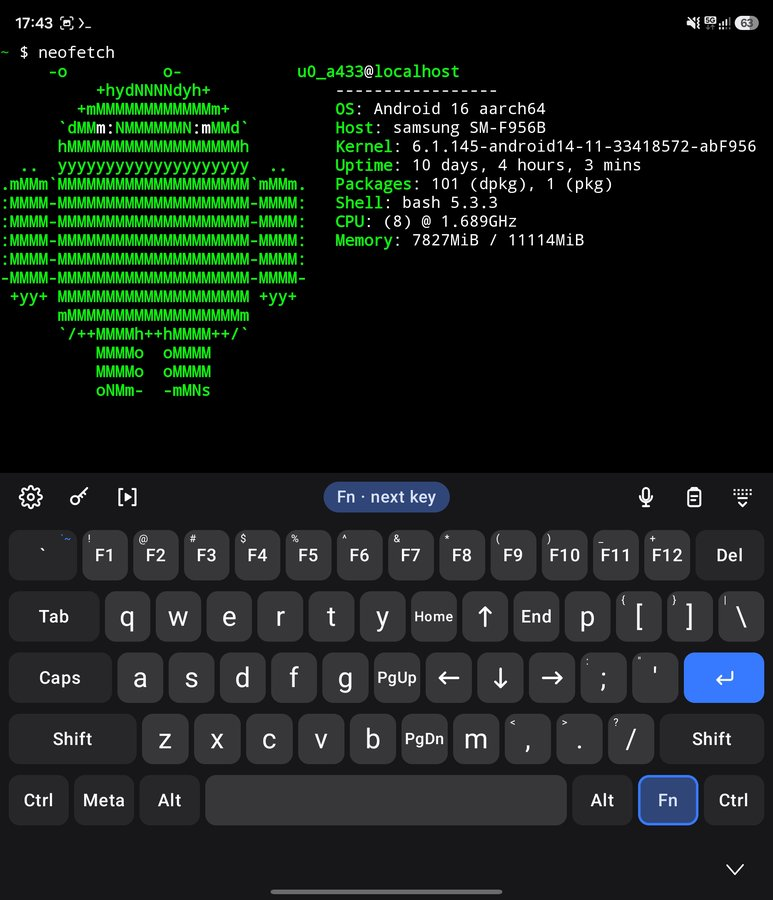
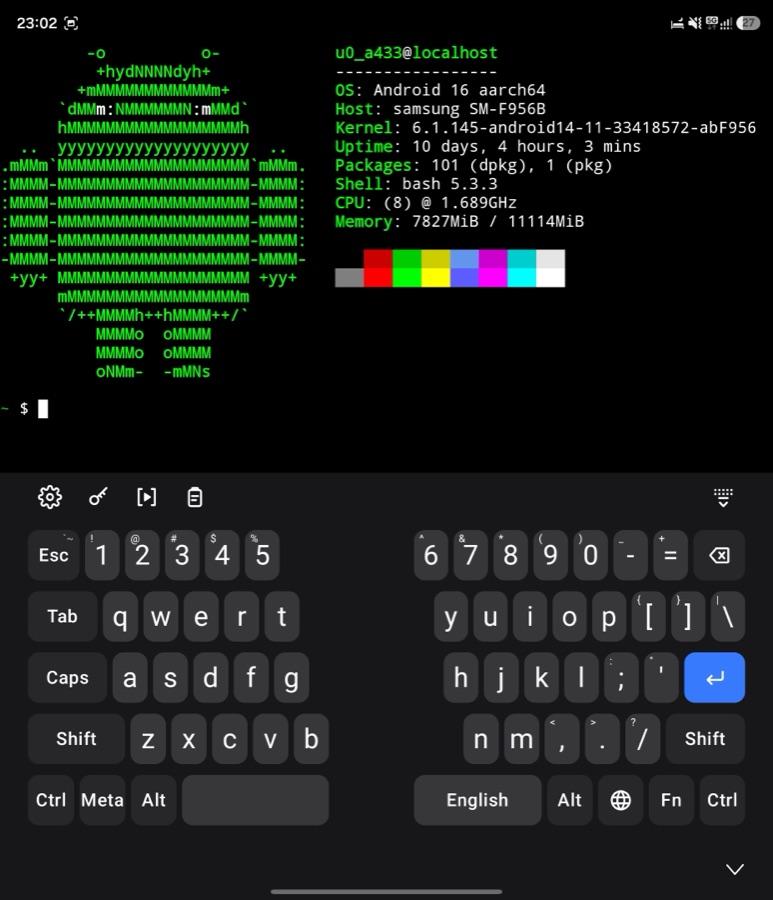
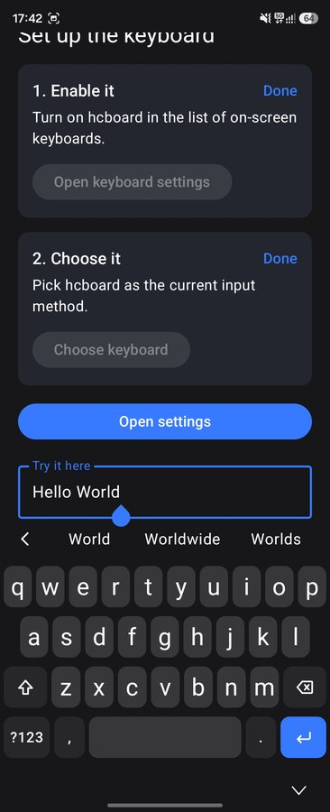
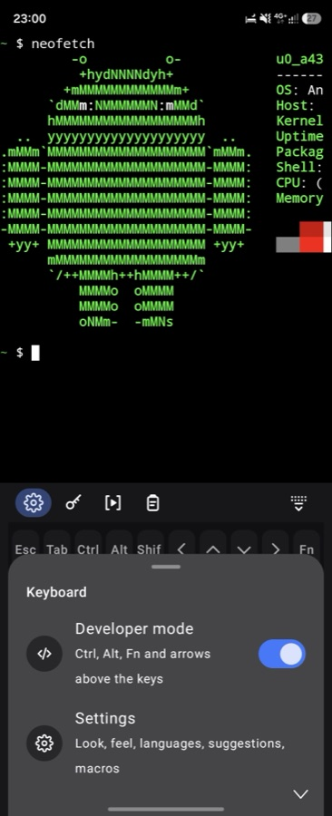
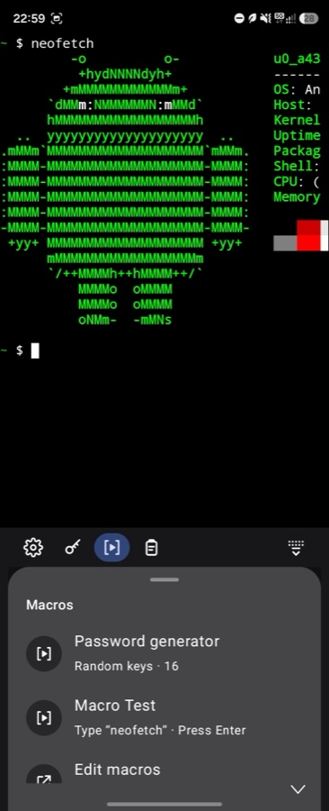
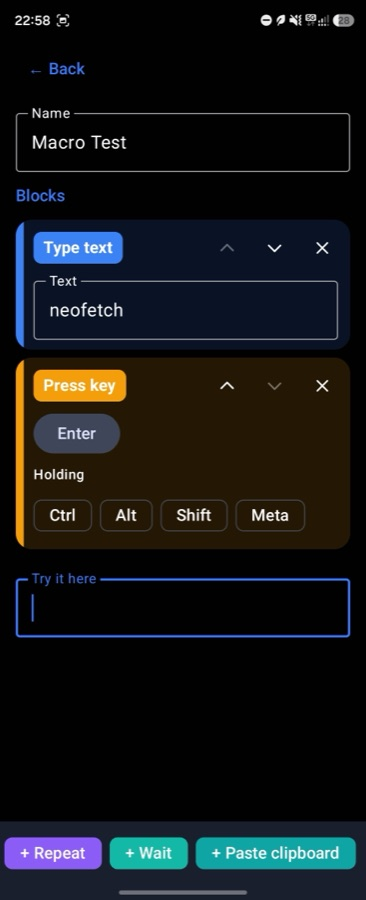

<div align="center">


# hcboard

**A keyboard for everyday typing that is ready when you want to tinker — and keeps to itself.**

[](https://github.com/matasarei/hcboard/actions/workflows/build.yml)
[](https://github.com/matasarei/hcboard/releases/latest)
[](https://github.com/matasarei/hcboard/releases/latest)
[](obtainium://app/https://github.com/matasarei/hcboard)
[](LICENSE)

[](#privacy)

</div>

## What it is

hcboard is an on-screen keyboard for Android you can use all day: chats, messages, search boxes,
forms. Type or glide across the letters, pick a word from the strip above the keys, and let a tap
of space fix the typo you just made — in any of ten languages, with the phone's own colours,
light or dark.

When you need more than letters, it is already there. Unfold the phone or pick up a tablet and you
get a full 60% layout: Esc, Tab, Caps, Ctrl, Alt, Meta, the symbols printed on the keys and F1–F12
behind Fn. On a phone, Developer mode under the toolbar's gear adds the same keys as a strip above
any layer. Ctrl+C in a terminal is a real Ctrl+C, so an SSH session or Termux behaves like a computer.

And it stays private. The app has no network permission at all, so nothing you type can leave the
phone — there is no analytics, no sync, no account, and nothing is written to a log. Passwords come
from the password manager you already use, and the keyboard never shows or keeps them.

[Read the story behind this project](https://hcnotes.cc/article/articles-the-keyboard-i-always-needed).

## What it looks like

| Fn armed on a foldable | Split in two |
|:---:|:---:|
|  |  |

- **Fn armed on a foldable:** every key of a 60% board, with the symbols printed where a PC keyboard
  has them. Arm Fn and the keys show what they will type.
- **Split in two:** the same board in two halves, one under each thumb: where a hinge crosses the
  screen, on a phone turned sideways, or always.

| Word suggestions | The gear | Macros, one tap | Building a macro |
|:---:|:---:|:---:|:---:|
|  |  |  |  |

- **Word suggestions:** words to pick while you type: the word as typed, its correction and
  completions.
- **The gear:** Developer mode and Settings, behind one button.
- **Macros, one tap:** play a macro into any field, a terminal included.
- **Building a macro:** snap blocks together, then try the macro right there.

## Everyday typing

- **The iPhone's layout, in Material:** each language's letters sit where the iPhone puts them
  (Russian leaves ъ to a long press on ь; Ukrainian has its apostrophe on the page and ґ on a
  long press on г), the bottom row is 123, comma, the globe, space, period and a wide return, and
  the symbol pages are the iPhone's 123 and #+=. Two quick spaces after a word type a full stop
  and a space; e-mail and web address fields have `@` or `/` where the comma is.
- **Glide typing** across the letters of every language, each with its own bundled word list.
- **Word suggestions** while you type: the word as typed, its correction and completions, in the
  toolbar behind a chevron. Space applies the highlighted correction and one backspace takes it
  back, and a word you took back is left alone for the rest of that field. Words with an
  apostrophe are words too, in English, Ukrainian, French and Italian: "whats" becomes "what's",
  "розвязок" becomes "розв'язок", "its" stays and offers "it's", and the apostrophe you typed
  (`'`, `’` or `ʼ`) is the one you get back. A word you tap gets a
  space after it; a following `.` `,` `!` `?` `;` `:` takes that space's place, so you never get
  "hello !". Both parts can be turned off, and neither runs in password, terminal, number, address
  or e-mail fields. An app that asks for no suggestions gets none, unless you allow that one app
  with Suggest in this app in the gear's sheet.
- **Your own words,** per language (Settings → Suggestions → Custom words): add a word and it is
  suggested, glide-typed and never corrected away; block one and it is never suggested or used as
  a correction.
- **A number row** of 1 to 0 above the letters on a phone, switched on in Settings or the gear's
  sheet; password and number fields always show it. Its #+= key then opens one page of symbols with no
  digits of its own. The 60% board always has its digits.
- **Capitals where a sentence starts,** in fields that ask for them (chat boxes do): the Shift key
  lights up, one tap on it cancels the capital, and terminals, addresses and code get none. It can
  be turned off in Settings.
- **Twenty-one languages:** English, Ukrainian, Russian, Bulgarian, French, Spanish, German, Italian,
  Portuguese, Polish, Dutch, Swedish, Danish, Finnish, Czech, Romanian, Greek, Croatian, Slovenian,
  Lithuanian and Latvian, each with its own layout and long-press accents. English is always on; add
  the others in Settings → Languages → Choose languages. With two or more, a globe key switches
  them: with three or more, a first tap goes back to the language you came from and further taps
  in a row go on through all of them, as on an iPhone, or every tap goes on to the next one, as on
  Gboard (chosen on the Languages screen). Holding it opens the list, and the
  space bar names the one you are typing in; Android's keyboard list and its switcher show the
  same languages. Bulgarian comes on two boards, phonetic (я в е р т) or the
  standard БДС one the iPhone uses (у е и ш щ), picked under Bulgarian in Settings. Portuguese
  spells as in Portugal or in Brazil, picked under Portuguese. For Russian speakers in Bulgaria
  who prefer typing on the Russian ЙЦУКЕН layout, an optional setting enables combined Bulgarian
  vocabulary with collision-safe autocorrect.
  *(Want your language or a feature? [Create an issue](https://github.com/matasarei/hcboard/issues) and tell me!)*
- **Works with TalkBack:** every key is read as what it types now, with the state of Shift and the
  modifiers, and what a long press holds (accents, the cursor trackpad, the language list) is an
  action on the key.
- **The feel of a phone keyboard:** a preview above the key you press, a spring under your finger,
  a light haptic tick, accents on a long press, and a cursor trackpad when you hold the space bar.
- **Your phone's look:** Material 3, with dynamic colour on Android 12 and later. Four themes —
  System, Light, Dark and Black — and the dark board is built on the same background your apps use.
  The highlight (Enter, a locked Shift or Ctrl, the chips) follows your phone's colours, or pick
  red, orange, yellow, green, teal, blue, indigo, purple, pink or a neutral grey from the swatches
  under the theme.
- **A toolbar that stays out of the way:** the gear (Developer mode, the number row and Settings,
  the same sheet on every board, with the phone-only switches dimmed on a wide one), your password
  manager and your macros on the left; the microphone (when a voice keyboard such as Google voice
  typing is enabled; Settings picks which one when you have several, or turns the button off),
  paste and hide on the right. On a phone the left buttons fold behind a › until you tap it, and
  fold again when the keyboard hides (turn on Always show toolbar buttons, in Settings or the
  gear's sheet, to keep them); wide screens always show them. While you type a word, its
  suggestions take the whole strip; the chevron closes them.
- **Your password manager, one tap away.** Logins it offers appear above the keys. The key button
  can also fill a login into the field in front of you, open the manager, or change which one
  Android uses.
- **Fits your hands:** set the keyboard's height and width, the space under the keys (or let it
  follow the system bar), the haptic tick and the key preview in Settings, and try each change in
  the field at the bottom of the screen, or in its password field.

## When you want to tinker

- **A 60% board on wide screens.** Foldables and tablets get every key of a standard 60% layout:
  the letters sit on the ANSI slots of the current language, punctuation that a long alphabet
  displaces stays reachable through Fn, and both Cyrillic layouts fill the top row (ї, ъ). Its
  edges are balanced so the letters sit nearer the middle of the screen, and it can split into a
  left and a right half: by itself where a hinge crosses the screen and on a phone turned sideways,
  or always, or never (Settings → Wide keyboard).
- **A developer strip on phones.** Developer mode, behind the toolbar's gear, puts Esc, Tab, Ctrl,
  Alt, Shift, arrows and Fn above any layer, and the keyboard remembers which apps you use it in.
- **Modifiers that latch the way you expect.** Tap one to arm it for the next key, double-tap or
  long-press to lock it, or hold it and tap another key with a second finger. They survive layer
  switches, and the toolbar says what is armed. Every key shows what it will type as Shift or Fn
  changes it.
- **Terminals get real key events.** Ctrl+C is a signal, not a copy; in ordinary text fields
  Ctrl+A/C/V/X are select, copy, paste and cut.
- **Positional shortcuts.** Ctrl+С on a Cyrillic board is Ctrl+C, as on a PC, and while a modifier
  is armed the keys show the Latin letters they will send.
- **Macros built from blocks.** Snap together coloured blocks — type text (tick Secret to hide it),
  press a key such as Esc, F1 or Shift, a combination like Ctrl+Shift+T, random keys, repeat, wait,
  paste, copy the field to the clipboard — then play the macro into any field from the toolbar's
  macro button (Settings → Macros). The editor has a field
  to try a macro in before you use it. One comes built in: a password generator that types 16
  random letters, digits and symbols.
- **Backup to one file** (Settings → Backup): export your settings, custom words and macros to a
  file you save where you like, and import it on this phone or another. Import replaces all three,
  after asking.

## Privacy

- **No `INTERNET` permission.** It is not in the manifest, so the app cannot reach the network even
  if it tried. No analytics, no crash reporting, no account, no sync.
- **Nothing you type is logged or stored.** Word lists ship inside the app; suggestions look only
  at the word before the cursor, on the phone, and not at all in a password or terminal field.
  The only words kept are the ones you add or block yourself in Custom words; like the settings,
  they stay on the phone and are part of Android's own backup of the app when that is on.
- **Autofill suggestions belong to your manager.** When it offers a login above the keys, those
  chips are views your manager draws; the keyboard places them and never reads them.
- **A login the keyboard types for you is held for one moment only.** "Fill a login" opens a small
  screen that your password manager fills. That screen blocks screenshots, shows nothing, and hands
  the login to the app you came from, within 30 seconds, once: started from a username field, the
  username goes there and the password into that app's next password field, within 10 seconds;
  started from a password field or a terminal, only the password goes in. Then it is overwritten in
  memory. It is never written down, logged, or put into an Android message between apps.
- **A generated password is typed, not kept.** The password generator's keys are made fresh on
  each run and go straight into the field as key presses; they are not stored, logged or shown by
  the keyboard, and word suggestions do not read them back.
- **Macros are saved like your settings.** They stay on the phone, and like the settings they are
  part of Android's own backup of the app when you have backup turned on. A text marked Secret is
  hidden on screen and saved encrypted, with a key kept in the phone's own keystore that never
  leaves it: a backup carries only the encrypted form, so after restoring onto another phone you
  type the secret again. Any other text is saved as you wrote it. The password generator makes new
  passwords each time and saves none.
- **Copying a field is your macro's doing, and never a password field's.** A Copy field block puts
  the field's text on the clipboard when the macro plays it, and does nothing in a password field.
  When the macro also types a secret or random keys, the copy is marked sensitive, so Android
  hides it in its clipboard preview.
- **A backup file goes only where you save it.** Export uses Android's own file picker; the
  keyboard still has no network access. The file is readable JSON, except the secret texts in your
  macros: those are encrypted with a passphrase you choose when you export (PBKDF2 and AES-GCM),
  which is not stored anywhere, so without it they cannot be restored. A secret this phone can no
  longer open (restored from Android's backup onto another phone) is exported empty.
- **Everything is on the phone**, which is also why there is nothing to sign in to.

## Install

### Option 1: Official Release (Recommended)
Download the latest signed release APK (`hcboard-vX.Y.Z.apk`) directly from [GitHub Releases](https://github.com/matasarei/hcboard/releases/latest).

> **Note for direct APK installs:** Because this is an independent open-source release with a newly created developer certificate, Android or Samsung Auto Blocker may show an *"Unrecognized app"* or *"Unknown developer"* prompt. Tap **More details › Install anyway**. The app requests zero network permissions and cannot transmit any data.

### Option 2: Automatic Updates via Obtainium
To receive automatic background update notifications without an app store:
1. Install [Obtainium](https://github.com/ImranR98/Obtainium) on your Android device.
2. Tap the **[Add to Obtainium](obtainium://app/https://github.com/matasarei/hcboard)** button (or tap **Add App** in Obtainium and paste `https://github.com/matasarei/hcboard`).
3. Tap **Add** to install and track updates.

### Option 3: Development Builds
Every push to `main` produces an automated debug build in the [dev pre-release](https://github.com/matasarei/hcboard/releases/tag/dev) (`hcboard-dev.apk`).

---

### Setup on your phone
After installing the APK, open **hcboard** from your app launcher. The setup screen guides you to:
1. Enable **hcboard** in your on-screen keyboards list.
2. Select **hcboard** as your active input method.
3. Tap **Open settings** to customise themes, height, and languages.

Or with adb:
```
adb install -r hcboard-release.apk
```

## Build

Requires JDK 17 and the Android SDK (platform 37).

```
./gradlew :app:testDebugUnitTest :app:lintDebug :app:assembleDebug
scripts/enable-ime.sh            # installs the debug APK and makes it the current keyboard
```

The instrumented smoke test needs an emulator or device: `./gradlew :app:connectedDebugAndroidTest`.

## Third-party code and data

hcboard is licensed under the [Apache License 2.0](LICENSE). It includes code and data from other
projects, under Apache-2.0 and, for the Ukrainian word list, CC BY 4.0; the exact attributions are
in [NOTICE](NOTICE), and the app shows them, with the libraries it is built on and their licences,
under Settings → About → Open-source licences.

| What | From | Licence |
|---|---|---|
| Glide-typing classifier (`input/glide/GlideClassifier.kt`) | [FlorisBoard](https://github.com/florisboard/florisboard), `StatisticalGlideTypingClassifier.kt` by The FlorisBoard Contributors, after Étienne Desticourt's analysis for AnySoftKeyboard | Apache-2.0 |
| Word lists for Russian, Bulgarian, French, Spanish, German, Italian, Brazilian Portuguese and Polish (`assets/dictionaries/`) | [Android Open Source Project](https://android.googlesource.com/platform/packages/inputmethods/LatinIME/), the `*_wordlist.combined` files, filtered by `scripts/build-wordlist.py` and merged with this project's everyday-word overlays (`scripts/wordlists/<language>-everyday.tsv`) | Apache-2.0 |
| Word lists for Dutch, Swedish, Danish, Finnish, Czech, Romanian, Greek, Croatian, Slovenian, Lithuanian, Latvian and European Portuguese (`assets/dictionaries/`) | [Android Open Source Project](https://android.googlesource.com/platform/packages/inputmethods/LatinIME/), the `*_wordlist.combined` files, filtered by `scripts/build-wordlist.py` | Apache-2.0 |
| English word list (`assets/dictionaries/en_US.txt`) | [Android Open Source Project](https://android.googlesource.com/platform/packages/inputmethods/LatinIME/), filtered by `scripts/build-wordlist.py` and merged with this project's modern-word overlay (`scripts/wordlists/en-modern.tsv`) | Apache-2.0 |
| Ukrainian word list (`assets/dictionaries/uk.txt`) | [Helium314/aosp-dictionaries](https://codeberg.org/Helium314/aosp-dictionaries), `wordlists_experimental/main_uk.combined`, built from the [Leipzig Corpora Collection](https://wortschatz.uni-leipzig.de/en/download/) word lists, merged with this project's everyday-word overlay (`scripts/wordlists/uk-everyday.tsv`) | CC BY 4.0 (overlay Apache-2.0) |
| UI toolkit and libraries | [AndroidX](https://developer.android.com/jetpack/androidx) and Jetpack Compose, Material 3 | Apache-2.0 |
| Language | [Kotlin](https://kotlinlang.org/) | Apache-2.0 |

Design references, not code: the layout follows Gboard's proportions and the feel follows the
iPhone keyboard; nothing from either was copied.

## Contributing

Want your language or a feature? [Create an issue](https://github.com/matasarei/hcboard/issues) and tell me!

`CLAUDE.md` holds the build commands and the conventions that matter in this codebase. Work lands
through pull requests to `main`; every pull request runs the unit tests and lint.
