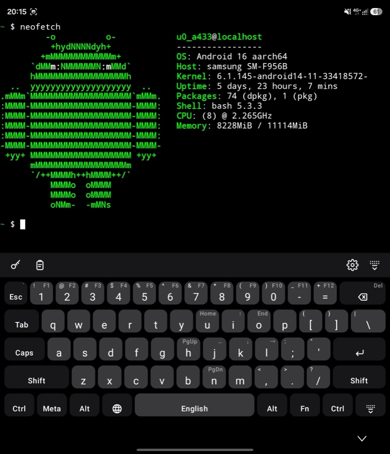
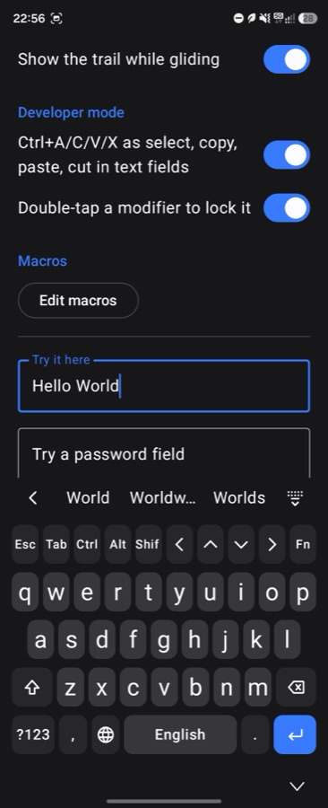

<div align="center">


# hcboard

**A keyboard for everyday typing that is ready when you want to tinker — and keeps to itself.**

[](https://github.com/matasarei/hcboard/actions/workflows/build.yml)
[](https://github.com/matasarei/hcboard/releases/latest)
[](https://github.com/matasarei/hcboard/releases/latest)
[](obtainium://app/https://github.com/matasarei/hcboard)
[](LICENSE)

[](#privacy)

</div>

## What it is

hcboard is an on-screen keyboard for Android you can use all day: chats, messages, search boxes,
forms. Type or glide across the letters, pick a word from the strip above the keys, and let a tap
of space fix the typo you just made — in any of ten languages, with the phone's own colours,
light or dark.

When you need more than letters, it is already there. Unfold the phone or pick up a tablet and you
get a full 60% layout: Esc, Tab, Caps, Ctrl, Alt, Meta, the symbols printed on the keys and F1–F12
behind Fn. On a phone, one tap on `</>` adds the same keys as a strip above any layer. Ctrl+C in a
terminal is a real Ctrl+C, so an SSH session or Termux behaves like a computer.

And it stays private. The app has no network permission at all, so nothing you type can leave the
phone — there is no analytics, no sync, no account, and nothing is written to a log. Passwords come
from the password manager you already use, and the keyboard never shows or keeps them.

## What it looks like

| Terminal on a foldable | Fn and Shift armed | Phone, with the developer strip |
|---|---|---|
|  |  |  |
| The whole 60% board, with the keys' symbols printed where a PC keyboard has them. | Hold Fn and the keys show what they will type, so nothing has to be remembered. | The same modifiers on a phone, one tap away, over any layer. |

## Everyday typing

- **Glide typing** across the letters of every language, each with its own bundled word list.
- **Word suggestions** while you type: the word as typed, its correction and completions, in the
  toolbar behind a chevron. Space applies the highlighted correction and one backspace takes it
  back. Both parts can be turned off, and neither runs in password, terminal, number, address or
  e-mail fields.
- **Capitals where a sentence starts,** in fields that ask for them (chat boxes do): the Shift key
  lights up, one tap on it cancels the capital, and terminals, addresses and code get none. It can
  be turned off in Settings.
- **Ten languages:** English, Ukrainian, Russian, Bulgarian, French, Spanish, German, Italian, Portuguese
  (Brazil) and Polish, each with its own layout and long-press accents. Until you change the set
  it follows your phone's languages, plus English; a globe key switches them, and holding it opens
  the list. For Russian speakers in Bulgaria who prefer typing on the Russian ЙЦУКЕН layout, an optional
  setting enables combined Bulgarian vocabulary with collision-safe autocorrect.
  *(Want your language or a feature? [Create an issue](https://github.com/matasarei/hcboard/issues) and tell me!)*
- **The feel of a phone keyboard:** a preview above the key you press, a spring under your finger,
  a light haptic tick, accents on a long press, and a cursor trackpad when you hold the space bar.
- **Your phone's look:** Material 3, with dynamic colour on Android 12 and later. Four themes —
  System, Light, Dark and Black — and the dark board is built on the same background your apps use.
- **Fits your hands:** set the keyboard's height, the space under the keys (or let it follow the
  system bar), key borders, the haptic tick and the key preview in Settings.

## When you want to tinker

- **A 60% board on wide screens.** Foldables and tablets get every key of a standard 60% layout:
  the letters sit on the ANSI slots of the current language, punctuation that a long alphabet
  displaces stays reachable through Fn, and both Cyrillic layouts fill the top row (ї, ъ).
- **A developer strip on phones.** One tap on `</>` puts Esc, Tab, Ctrl, Alt, Shift, arrows and Fn
  above any layer, and the keyboard remembers which apps you use it in.
- **Modifiers that latch the way you expect.** Tap one to arm it for the next key, double-tap or
  long-press to lock it, or hold it and tap another key with a second finger. They survive layer
  switches, and the toolbar says what is armed. Every key shows what it will type as Shift or Fn
  changes it.
- **Terminals get real key events.** Ctrl+C is a signal, not a copy; in ordinary text fields
  Ctrl+A/C/V/X are select, copy, paste and cut.
- **Positional shortcuts.** Ctrl+С on a Cyrillic board is Ctrl+C, as on a PC, and while a modifier
  is armed the keys show the Latin letters they will send.

## Privacy

- **No `INTERNET` permission.** It is not in the manifest, so the app cannot reach the network even
  if it tried. No analytics, no crash reporting, no account, no sync.
- **Nothing you type is logged or stored.** Word lists ship inside the app; suggestions look only
  at the word before the cursor, on the phone, and not at all in a password or terminal field.
- **Autofill suggestions belong to your manager.** When it offers a login above the keys, those
  chips are views your manager draws; the keyboard places them and never reads them.
- **A login the keyboard types for you is held for one moment only.** "Fill a login" opens a small
  screen that your password manager fills. That screen blocks screenshots, shows nothing, and hands
  the login to the app you came from, within 30 seconds, once: started from a username field, the
  username goes there and the password into that app's next password field, within 10 seconds;
  started from a password field or a terminal, only the password goes in. Then it is overwritten in
  memory. It is never written down, logged, or put into an Android message between apps.
- **Everything is on the phone**, which is also why there is nothing to sign in to.

## Install

### Option 1: Official Release (Recommended)
Download the latest signed release APK (`hcboard-vX.Y.Z.apk`) directly from [GitHub Releases](https://github.com/matasarei/hcboard/releases/latest).

> **Note for direct APK installs:** Because this is an independent open-source release with a newly created developer certificate, Android or Samsung Auto Blocker may show an *"Unrecognized app"* or *"Unknown developer"* prompt. Tap **More details › Install anyway**. The app requests zero network permissions and cannot transmit any data.

### Option 2: Automatic Updates via Obtainium
To receive automatic background update notifications without an app store:
1. Install [Obtainium](https://github.com/ImranR98/Obtainium) on your Android device.
2. Tap the **[Add to Obtainium](obtainium://app/https://github.com/matasarei/hcboard)** button (or tap **Add App** in Obtainium and paste `https://github.com/matasarei/hcboard`).
3. Tap **Add** to install and track updates.

### Option 3: Development Builds
Every push to `main` produces an automated debug build in the [dev pre-release](https://github.com/matasarei/hcboard/releases/tag/dev) (`hcboard-dev.apk`).

---

### Setup on your phone
After installing the APK, open **hcboard** from your app launcher. The setup screen guides you to:
1. Enable **hcboard** in your on-screen keyboards list.
2. Select **hcboard** as your active input method.
3. Tap **Open settings** to customise themes, height, and languages.

Or with adb:
```
adb install -r hcboard-release.apk
```

## Build

Requires JDK 17 and the Android SDK (platform 37).

```
./gradlew :app:testDebugUnitTest :app:lintDebug :app:assembleDebug
scripts/enable-ime.sh            # installs the debug APK and makes it the current keyboard
```

The instrumented smoke test needs an emulator or device: `./gradlew :app:connectedDebugAndroidTest`.

## Third-party code and data

hcboard is licensed under the [Apache License 2.0](LICENSE). It includes code and data from other
projects, under Apache-2.0 and, for the Ukrainian word list, CC BY 4.0; the exact attributions are
in [NOTICE](NOTICE).

| What | From | Licence |
|---|---|---|
| Glide-typing classifier (`input/glide/GlideClassifier.kt`) | [FlorisBoard](https://github.com/florisboard/florisboard), `StatisticalGlideTypingClassifier.kt` by The FlorisBoard Contributors, after Étienne Desticourt's analysis for AnySoftKeyboard | Apache-2.0 |
| Word lists for Russian, Bulgarian, French, Spanish, German, Italian, Portuguese (Brazil) and Polish (`assets/dictionaries/`) | [Android Open Source Project](https://android.googlesource.com/platform/packages/inputmethods/LatinIME/), the `*_wordlist.combined` files, filtered by `scripts/build-wordlist.py` and merged with this project's everyday-word overlays (`scripts/wordlists/<language>-everyday.tsv`) | Apache-2.0 |
| English word list (`assets/dictionaries/en_US.txt`) | [Android Open Source Project](https://android.googlesource.com/platform/packages/inputmethods/LatinIME/), filtered by `scripts/build-wordlist.py` and merged with this project's modern-word overlay (`scripts/wordlists/en-modern.tsv`) | Apache-2.0 |
| Ukrainian word list (`assets/dictionaries/uk.txt`) | [Helium314/aosp-dictionaries](https://codeberg.org/Helium314/aosp-dictionaries), `wordlists_experimental/main_uk.combined`, built from the [Leipzig Corpora Collection](https://wortschatz.uni-leipzig.de/en/download/) word lists, merged with this project's everyday-word overlay (`scripts/wordlists/uk-everyday.tsv`) | CC BY 4.0 (overlay Apache-2.0) |
| UI toolkit and libraries | [AndroidX](https://developer.android.com/jetpack/androidx) and Jetpack Compose, Material 3 | Apache-2.0 |
| Language | [Kotlin](https://kotlinlang.org/) | Apache-2.0 |

Design references, not code: the layout follows Gboard's proportions and the feel follows the
iPhone keyboard; nothing from either was copied.

## Contributing

Want your language or a feature? [Create an issue](https://github.com/matasarei/hcboard/issues) and tell me!

`CLAUDE.md` holds the build commands and the conventions that matter in this codebase. Work lands
through pull requests to `main`; every pull request runs the unit tests and lint.
